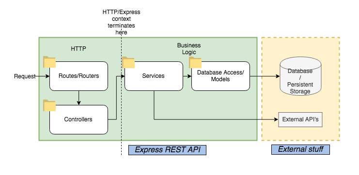

# nice-backend

Node.JS 백엔드 프로젝트의 시작부터 배포까지 필요한 요소를 모두 담은 프로젝트 뼈대입니다.

# What's inside
- DB usage with TypeORM (configured for MySQL, can be changed)
- Basic passport.js implementation (`passport-local`)
- HTTPS support
- TSLint
- Swagger, TSDoc documentations
- 

# 처음 시작하기
1. DB 접속정보 추가

`ormconfig.json`에 아래 형태로 DB 접속정보를 저장합니다.
```json
{
  "type": "mysql",
  "host": "localhost",
  "port": 3306,
  "username": "test",
  "password": "test",
  "database": "test"
}
```
자세한 설정은 [TypeORM docs](https://typeorm.io/#/using-ormconfig)에서 확인하세요.

# Notes

## HTTPS support
- HTTPS is only active in production mode (edit www.dev.ts to change this).
- Add your certificate (`server.key`, `server.crt`) under `./sslcert`

## REST structure



_[이미지 출처](https://www.coreycleary.me/project-structure-for-an-express-rest-api-when-there-is-no-standard-way/)_

1. 라우터 (/routes): HTTP 요청을 받음, 컨트롤러로 넘기기 전 유효성 확인, 권한 확인 수행
- 잘못된 요청이 들어올 경우 `400`, 권한이 없을 경우 `403` 반환
- Swagger 문서는 여기에 작성함
2. 컨트롤러 (/controllers): HTTP 요청을 처리하는 단계
- `req`, `res`를 인자로 받아 적절한 결과 반환
- 서비스를 이용해 요청을 수행하고, JSON 형태로 결과를 보내는 역할
- **DB 작업은 컨트롤러에서 하지 않으며**, 데이터를 다루는 로직은 서비스에서 수행
3. 서비스 (/services): 실제 로직을 수행하는 단계
- 서비스는 HTTP `req`, `res`에 접근할 수 없음: 서버와 무관하게 동작해야 함
- 데이터베이스 접근은 이 단계에서 이루어짐

# 주요 라이브러리
프로젝트를 시작하기 전 이용방법을 숙지하시길 바립니다.
- [express-validator](https://express-validator.github.io/docs/): 요청 유효성 확인에 사용

# 관련 문서
- https://blog.wonhada.com/nginx-sslhttps-node-js/
- https://dev.to/rxassim/setup-postgresql-with-typeorm-in-graphql-tutorial-1cn8